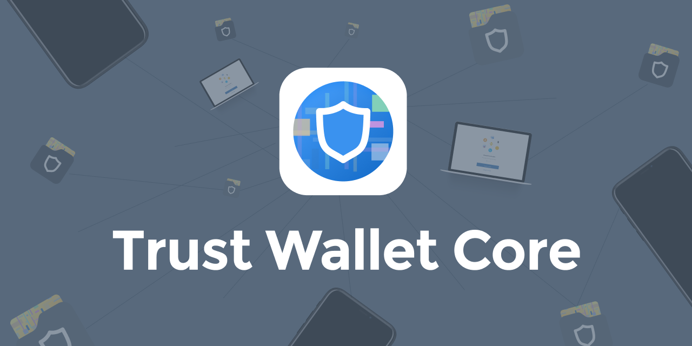

Trust Wallet Core is an open-source, cross-platform, mobile-focused library
implementing low-level cryptographic wallet functionality for a high number of blockchains.
It is a core part of the popular [Trust Wallet](https://trustwallet.com), and some other projects.
Most of the code is C++ with a set of strict C interfaces, and idiomatic interfaces for supported languages:
Swift for iOS and Java (Kotlin) for Android.


[](https://sonarcloud.io/summary/new_code?id=TrustWallet_wallet-core)

[](https://gitpod.io/#https://github.com/trustwallet/wallet-core)


# Documentation

For comprehensive documentation, see [developer.trustwallet.com](https://developer.trustwallet.com/wallet-core).

# Supported Blockchains

Wallet Core supports more than **130** blockchains: Bitcoin, Ethereum, BNB, Cosmos, Solana, and most major blockchain platforms.
The full list is [here](docs/registry.md).

# Building

For build instructions, see [developer.trustwallet.com/wallet-core/building](https://developer.trustwallet.com/wallet-core/building).


# Using from your project

If you want to use wallet core in your project follow these instructions.

## Android

Android releases are hosted on [GitHub packages](https://github.com/trustwallet/wallet-core/packages/700258), you need to add GitHub access token to install it. Please check out [this installation guide](https://developer.trustwallet.com/wallet-core/integration-guide/android-guide#adding-library-dependency) or `build.gradle` from our [android sample](https://github.com/trustwallet/wallet-core/blob/master/samples/android/build.gradle)

Don't forget replacing the version in the code with latest: 

## iOS

We currently support Swift Package Manager and CocoaPods (will discontinue in the future).

### SPM

Download latest `Package.swift` from [GitHub Releases](https://github.com/trustwallet/wallet-core/releases) and put it in a local `WalletCore` folder.

Add this line to the `dependencies` parameter in your `Package.swift`:

```swift
.package(name: "WalletCore", path: "../WalletCore"),
```

Or add remote url + `master` branch, it points to recent (not always latest) binary release.

```swift
.package(name: "WalletCore", url: "https://github.com/trustwallet/wallet-core", .branchItem("master")),
```

Then add libraries to target's `dependencies`:

```swift
.product(name: "WalletCore", package: "WalletCore"),
.product(name: "SwiftProtobuf", package: "WalletCore"),
```

### CocoaPods

Add this line to your Podfile and run `pod install`:

```ruby
pod 'TrustWalletCore'
```

## NPM (beta)

```js
npm install @trustwallet/wallet-core
```

## Go (beta)

Please check out the [Go integration sample](https://github.com/trustwallet/wallet-core/tree/master/samples/go).

## Kotlin Multipleplatform (beta)

Please check out the [Kotlin Multiplatform sample](https://github.com/trustwallet/wallet-core/tree/master/samples/kmp)

# Projects

Projects using Trust Wallet Core. Add yours too!

[](https://trustwallet.com)

[Coinpaprika](https://coinpaprika.com/)
| [crypto.com](https://crypto.com)
| [Alice](https://www.alicedapp.com/)
| [Frontier](https://frontier.xyz/)
| [Tokenary](https://tokenary.io/)
| [MemesWallet](https://planetmemes.com/)
| [xPortal](https://xportal.com/)
| [Slingshot](https://slingshot.finance/)

# Community

There are a few community-maintained projects that extend Wallet Core to some additional platforms and languages. Note this is not an endorsement, please do your own research before using them:

- Flutter binding https://github.com/weishirongzhen/flutter_trust_wallet_core
- Python binding https://github.com/phuang/wallet-core-python
- Wallet Core on Windows https://github.com/kaetemi/wallet-core-windows

# Contributing

The best way to submit feedback and report bugs is to [open a GitHub issue](https://github.com/trustwallet/wallet-core/issues/new).
If you want to contribute code please see [Contributing](https://developer.trustwallet.com/wallet-core/contributing).
If you want to add support for a new blockchain also see [Adding Support for a New Blockchain](https://developer.trustwallet.com/wallet-core/newblockchain), make sure you have read the [requirements](https://developer.trustwallet.com/wallet-core/newblockchain#requirements) section.

Thanks to all the people who contribute.
<a href="https://github.com/trustwallet/wallet-core/graphs/contributors"></a>

# Disclaimer

The Wallet Core project is led and managed by Trust Wallet with a large contributor community and actively used in several projects.  Our goal at Wallet Core is to give other wallets an easy way to add chain support.

Trust Wallet products leverage wallet core, however, they may or may not leverage all the capabilities, features, and assets available in wallet core due to their own product requirements.

# License

Trust Wallet Core is available under the Apache 2.0 license. See the [LICENSE](LICENSE) file for more info.
