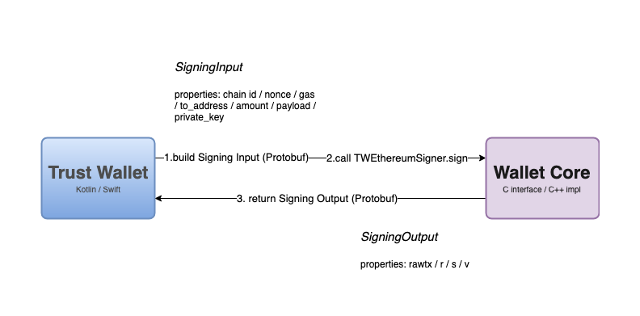

# Contributing

We want to make Trust Wallet Core as good as it can be. If you want to
contribute your help is greatly appreciated. Contributing is also a great way
to learn more about blockchain technology and a great way improving Trust
Wallet. To make the process as smooth as possible please read this document
and follow our guidelines. We are happy to review your code but please ensure
that you have a [clean pull request](#pull-requests).

Wallet Core implements the cryptographic functionality of blockchains. This
includes elliptic curve cryptography, hashing, address derivation and
transaction signing. However it *does not* implement other aspects like
networking and UI. Wallet core behaves like a black box for higher level users
like Trust Wallet; it takes inputs from the blockchain and the user (for
instance UTXOs, private keys, etc.) and produces an output (like a signed and
encoded transaction). Keep this in mind when adding functionality.

This is a diagram representing how Trust Wallet interacts with Trust Wallet Core.



## Library Design Guidelines

This library is designed so that it can be used from any other programming
languages, and that every language has an idiomatic interface. Design goals
also include minimizing the binary size and maximizing performance.

With these goals in mind we chose C/C++ for the implementation and a strict
subset of C for the interface. This C interface is used to generate the
idiomatic interfaces for every supported language. To augment the expressivity
of the interface we also use Protocol Buffer objects that get serialized across
the interface.

Keep this in mind when adding to the library:
* Only expose C headers. Clients should not have access to the C++ interfaces.
* C headers need to have annotations for the code generation tool, see below.
* Use Protocol Buffers to represent models. C doesn't have good abstractions for variable-sized types.
* Every time you modify the interface run the code generation tool and make sure the interface also makes sense in target languages.

## Pull Requests

Please follow these instructions when submitting a pull request (PR):

* Create a personal fork of the project on GitHub.
* Clone the fork on your local machine. Your remote repo on Github is called `origin`.
* Add the official repository as a remote called `upstream`.
* If you created your fork a while ago be sure to pull upstream changes into your local repository.
* Create a new branch to work on! Branch from the latest `upstream/master`.
* Implement/fix your feature, comment your code.
* Write or adapt tests as needed.
* Follow the code style of the project, including indentation. Use `clang-format` if you are unsure.
* Run the tests.
* Modify your commit history so that it tells a story using git's [interactive rebase](https://git-scm.com/book/en/v2/Git-Tools-Rewriting-History). Create a new branch if necessary.
* Write your commit messages in the present tense. Your commit message should describe what the commit, when applied, does to the code, not what you did to the code.
* Push your branch to your fork on Github, the remote `origin`.
* From your fork open a pull request in the correct branch. Target the project's `master` branch.
* If we request further changes push them to your branch. The PR will be updated automatically.
* Once the pull request is approved and merged you can pull the changes from `upstream` to your local repo and delete
your extra branch(es).

Is it not uncommon for a PR to accumulate commits and merges with time. The
library is in constant change. If your PR falls out of sync with the upstream
master you need to rebase. We can't reliably review code that is spread over
too many other changes to the codebase. Please use git's
[interactive rebase](https://git-scm.com/book/en/v2/Git-Tools-Rewriting-History) and
if necessary create a new PR.

## Before you start

* Install Xcode
* Install Xcode command line tools: `xcode-select --install`
* Install other tools: `brew install cmake ninja boost autoconf automake libtool xcodegen clang-format`
* Install [Android Studio](https://developer.android.com/studio/index.html)
* Install the [Android NDK](https://developer.android.com/ndk/guides/)

If you are working on Linux please see the Dockerfile for steps to install dependencies.

## Project organization

This project has a number of different pieces. Each piece lives in its own subfolder.
* The `docs` folder contains documentation.
* The `src` folder contains the C++ implementation of the core functionality.
* The `include` folder contains the public C header files used to expose a cross-platform interface.
* The `codegen` folder contains the code and templates used to generate code for different platforms and languages.
* The `jni` folder contains the generated JNI interface and Java classes.
* The `js` folder contains the generated NAPI C++ bindings and JavaScript classes.
* The `android` folder contains the Android Studio project and integration tests.
* The `swift` folder contains the generated Swift code and Xcode project.
* The `trezor-crypto` folder contains a fork of https://github.com/trezor/trezor-crypto/ with modifications.
* The `tests` folder contains unit tests.
* THe `tools` folder contains scripts to automate common tasks.

## Building

Use the `bootstrap.sh` script in the root folder to quickly build and test.

The build pipeline uses CMake. If you add or rename files you need to re-run cmake: `cmake -H. -Bbuild -DCMAKE_BUILD_TYPE=Debug`. If you only change existing files and want to run the tests you only need to run make: `make -C build tests`.

If you change interface files in the include folder you need to regenerate the interface code: `codegen/bin/codegen`. Run `codegen/bin/codegen -h` to get usage information on the tool. Note that currently if you add a new interface header file you need to manually add that file as a public header to the iOS project, otherwise iOS tests will fail.

## Testing

Use the `bootstrap.sh` script in the root folder to quickly build and test. After you have run either `bootstrap.sh` or `cmake`, run `make -C build tests && build/tests/tests tests`. This will run all the C++ tests, Or use XCode for testing and debugging. Run `cmake -Bxcode -GXcode -DCMAKE_BUILD_TYPE=Debug` to generate a Xcode project. Then go to `xcode/` folder and open `TrustWalletCore.xcodeproj`.

To run integration tests on each platform run the respective script in the tools folder:

* Android: run `tools/android-test` or import `android` folder to Android Studio
* iOS: run `tools/ios-test` or cd `swift` folder, run `pod install` and open `TrustWalletCore.xcworkspace`
* JavaScript: run `tools/js-test` or cd `js` folder, run `npm test`


## C Headers

The wallet core code generator parses C headers for class and struct definitions. Headers need to be in the `include/TrustWalletCode` folder and start with the `TW` prefix followed by the class or sturct name. Inside each header file there needs to be exactly one class or struct defition.

A class definition starts with the `TW_EXPORT_CLASS` macro followed by a forward-declared struct. For example:
```c
TW_EXPORT_CLASS
struct TWPrivateKey;
```

Similarly, a struct definition start with the `TW_EXPORT_STRUCT` macro followed by an inline-declared struct. For example:
```c
TW_EXPORT_STRUCT
struct TWPublicKey {
    uint8_t bytes[TWPublicKeyUncompressedSize];
};
```

You can also define enumerations using the `TW_EXPORT_ENUM()` macro:
```
TW_EXPORT_ENUM(uint32_t)
enum TWCoinType {
    TWCoinTypeBitcoin = 0,
};
```

After the class or struct definition you can declare as many methods and properties as necessary. There are four types of declarations: static method, static property, method, and property. Each is declared by `TW_EXPORT_STATIC_METHOD`, `TW_EXPORT_STATIC_PROPERTY`, `TW_EXPORT_METHOD`, and `TW_EXPORT_PROPERTY` respectively. Each method or property name needs to start with the type name. For instance `TWPublicKeyIsValid` gets translated to the `isValid` property in the `PublicKey` type.

The types that methods can take and return are restricted to: `bool`, `int`, `size_t`, `uint8_t`, `uint16_t`, `uint32_t`, `uint64_t`, `TWData`, `TWString`, and any defined classses, structs or enums.

Methods always take the type as their first argument. The type needs to be a pointer if the type is a class and a struct if the type is a struct. Properties need to take the type as its only argument.

Static property declarations can take no arguments. Static methods can take any arguments.

## Protocol Buffers

Since the C language doesn't provide good abstractions for variable-sized arrays and strings, the C interface uses [Protocol Buffers](https://developers.google.com/protocol-buffers/). All models are defined in the `src/proto` folder. These models can then be used in the C interface by using the proto model name with underscores. For instance `TW_Binance_Proto_SigningInput`.

The proto file will be used to generate C++ classes and also classes in each supported client language (Swift, Java, etc.). The code generator will also generate the protobuf serialization code so that library clients don't have to worry about serialization. To generate the Protocol Buffers code run the `tools/generate-files` script when you modify the `src/TrustWalletCore.proto` file.

## Blockchain checklist

When implementing a new blockchain make sure you go through this checklist:
- [ ] Implement functionality in C++. Put it in a subfolder of `src/`.
    - [ ] Address (if necessary)
    - [ ] Transaction (if necessary)
    - [ ] Signer
- [ ] Write unit tests. Put them in a subfolder of `tests/`.
    - [ ] `Mnemonic phrase - > Address` derivation test. Put this test in the `CoinTests.cpp` file
- [ ] Add the coin definition to `coins.json`.
- [ ] Add relevant constants in `TWCoinType`, `TWP2SHPrefix`, `TWEthereymChainID`, `TWHRP`, etc., as necessary.
- [ ] Implement address validation and derivation in `src/Coin.cpp`.
- [ ] Write interface header in `include/TrustWalletCore` and implement the interface in `src/interface`.
    - [ ] Address interface (if necessary).
    - [ ] Signing interface.
- [ ] Validate generated code in Android an iOS projects. Write integration tests for each.
- [ ] Add a coin icon to "Supported Blockchains" section in `README.md`
    - [ ] Upload coin icon to [TrustWallet/tokens](https://github.com/TrustWallet/tokens) if necessary

Also check out the [Adding Support for a New Blockchain](https://github.com/TrustWallet/wallet-core/wiki/Adding-Support-for-a-New-Blockchain) document.

## Code Style

Wallet core follows the [LLVM Coding Standards](http://llvm.org/docs/CodingStandards.html) for C++. We use `clang-format` to ensure a consistent code sytle. **Do not** reformat files that you didn't modify, or the header files in the `include` folder. You can install a clang-format extension for your IDE.

## Docker

Wallet core provides a Dockerfile that sets up an Ubuntu container with the necessary dependencies. To build the docker image run `docker build .` in the root folder. To run a pre-built image run `docker run -it albinance/wallet-core /bin/bash`. Use `docker push` if you want to upload your own image to Docker Hub.

## Releasing

Before releasing please update the version numbers in `android/gradle.properties` and `TrustWalletCore.podspec` and commit this change. Then create a new git tag for that number and push (replace 0.0.0 with the actual version number):

```
git tag 0.0.0
git push
git push origin 0.0.0
```

### iOS

Run `bootstrap.sh` then `tools/ios-release`. This will build, archive and upload a Cocoapod. You need to be registered as an owner for the pod.

### JavaScript

#### First Time
You need to first log into your npm account that has permissions to publish.
```
$ npm login
```

#### Every Release
1. Run `bootstrap.sh`.
2. Update the version number in `js/package.json` and the `npm` badge in `js/README.md`
3. Run `tools/js-release` to build, test and publish the updated version to the `npm` registry.

### Android

#### First Time

1. See https://docs.gradle.org/current/userguide/signing_plugin.html to set up GPG signing.
2. Get a OSSRH username and password, get added to the group ID.
3. Install PGP Tools : `brew install gnupg`  -  https://gpgtools.org/
4. Create `~/.gradle/gradle.properties` and add your information from the previous steps:

- Generate GPG Key
- Send Key to the server using the installed tool GPG Keychain
- Generate the signing.keyId value:
 ```
$ gpg --list-keys --keyid-format short
```
- Get the `.gpg` secret key that will be assigned to signing.secretKeyRingFile parameter:
```
$ gpg --export-secret-keys -o secring.gpg
```

```
NEXUS_USERNAME=user
NEXUS_PASSWORD=pass

signing.keyId=00000000
signing.password=password
signing.secretKeyRingFile=/Users/me/.gnupg/secring.gpg

org.gradle.daemon=true
```

#### Every Release

1. Update the `VERSION_NAME` in `android/gradle.properties`.
2. In the `android` folder run `./gradlew uploadArchive`.
3. Go to the [Sonatype](https://oss.sonatype.org/#stagingRepositories) webpage. Look for the staging library. It should be at the end of the list. Select it, and press “Close” button.
